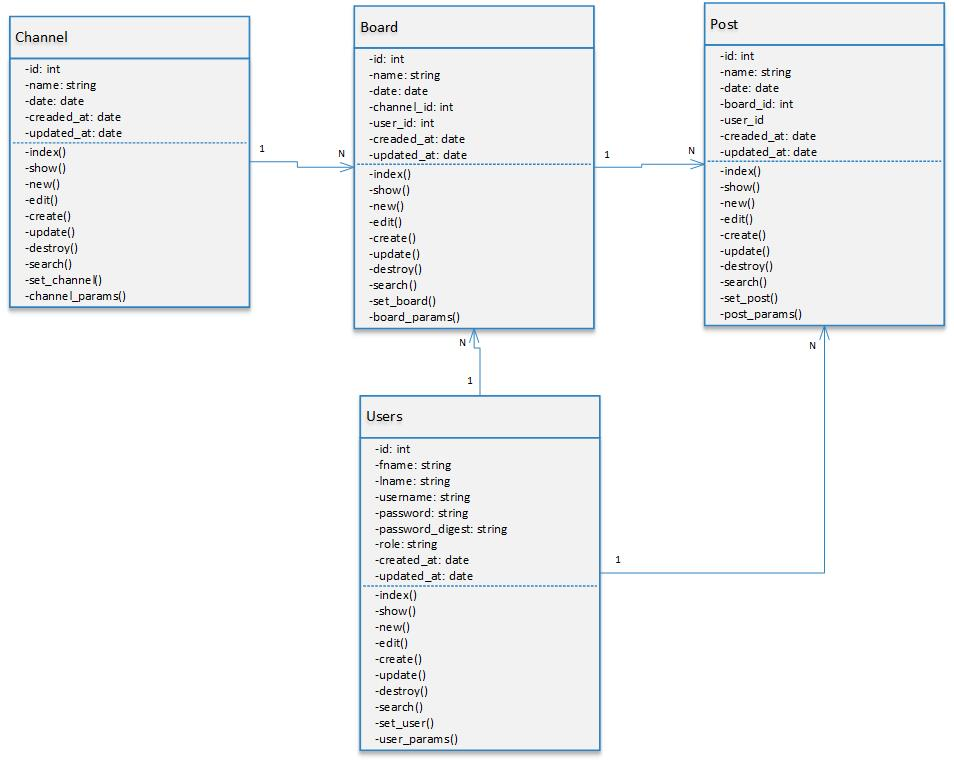
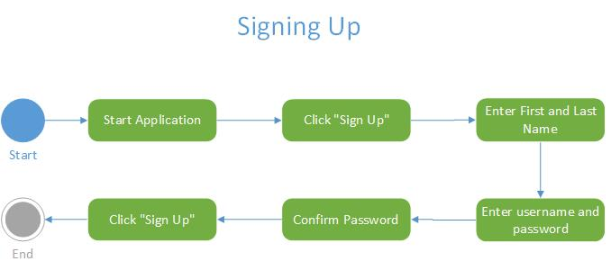
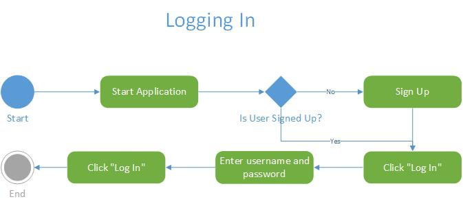
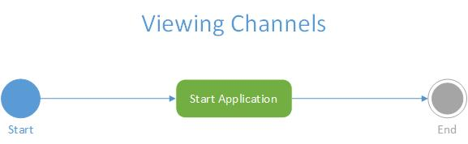
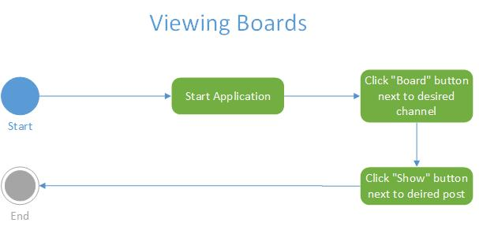
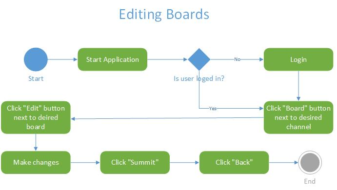
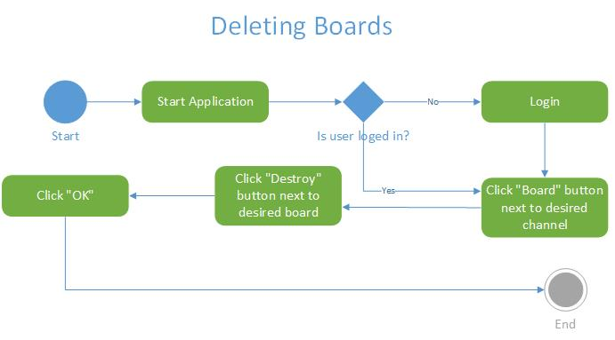
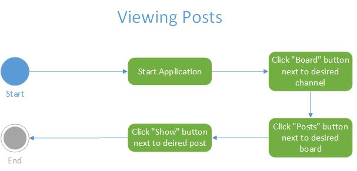
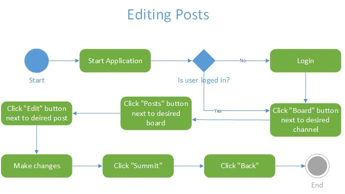
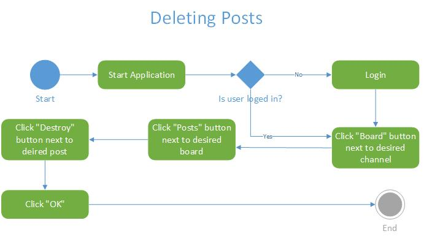

= 4339 Semester Project
:toc:
:toclevels: 3

== Design Documentation

=== Full UML Model

=== UML Activity Diagrams

{empty} +

{empty} +

{empty} +

{empty} +

{empty} +

{empty} +

{empty} +

{empty} +

{empty} +

== User Manual

This manual will go over how to use the message board from the perspective of a board manager, regular user, and company manager. Each role has access to several which will be documented here for reference. 

=== Board Manager

==== To uploading user information with a CSV file

. Click Home Page in the navigation bar.

. Click Log In on the top right hand corner.

. Enter your credentials (username and password) to log in.

. Click Users on the navigation bar.

. Click the Choose File button and select the CSV from your files you wish to upload.

. Click the open button to select your file.

. Click the Import CSV button and it will upload your CSV.

==== To manage users and their access rights

. Click Home Page in the navigation bar.

. Click Users on the navigation bar.

. Click Edit from any user that you wish to change their access right.

. Use the only drop down box to change the user's access rights.

. Enter their credentials and click the Sign Up button to change their access rights.

==== To reset a user’s password

. Click Home Page in the navigation bar.

. Click Users on the navigation bar.

. Click Edit from any user that you wish to change their password.

. Enter the desired password and click the Sign Up button to change their password.

==== To create a channel

. Click Home Page in the navigation bar.

. Click the New Channel button at the bottom of the screen.

. Enter the new channel name you would like to name the channel and hit the submit button.

==== To view reports on daily activity by board

. Click Home Page in the navigation bar.

. Click Channel you wish to view the reports on.

. The report will be at the bottom of the page.

==== To view reports on daily activity by user

. Click Home Page in the navigation bar.

. Click Channel you wish to view the reports on.

. The report will be at the bottom of the page.

=== Board User

==== To create an account

. Click Home Page in the navigation bar.

. Click Sign up in the navigation bar.

. Enter the prompted information.

. Hit the sign up button to create the account.

==== To change my password

. Click the Account drop down in the navigation bar.

. Click profile.

. Click the Edit button.

. Enter your new password.

. Click the Sign Up button to finalize your new password.

==== To post a question to a board

. Click Home Page in the navigation bar.

. Click the channel you want to post in.

. Click the New Board link.

. Enter the necessary information and click submit to post!

==== To delete a post

. Click Home Page in the navigation bar.

. Click the channel you want to delete the post in.

. Click the board you want to delete the post in.

. Click the destroy option next to the post you want to delete.

==== To reply to a post

. Click Home Page in the navigation bar.

. Click the channel you want to post in.

. Click the posts option next to the board you want to post in.

. Enter the necessary information and click submit to post!

==== To search for a post

. Click Home Page in the navigation bar.

. Click the channel you want to search in.

. Click the posts option next to the board you want to search in.

. Enter your search into the search bar.

== Post-Mortem

This Project allowed us to get a hands-on experience with rails and look at the power as well as functionality that comes with a rails app.  A very interesting part of working with rails is interacting with all the possible gems available and being able to find one already made for any function you can think of.  However, dealing with gems can sometimes be problematic, most popular gems have decent documentation other less prominent ones may not. This also requires developers to become familiar with functions that they may not be used to.  Our project team was not too familiar with rails syntax as well as some of its other features which gave us some difficulties during a project.  If given more time or team would experiment more and polish up the project  in areas and maybe lacking.